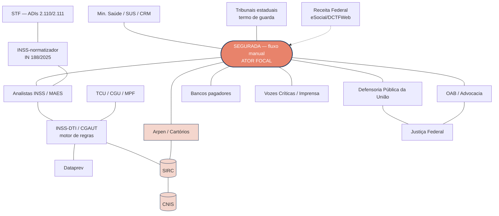
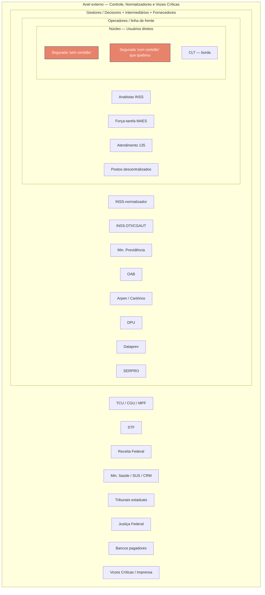
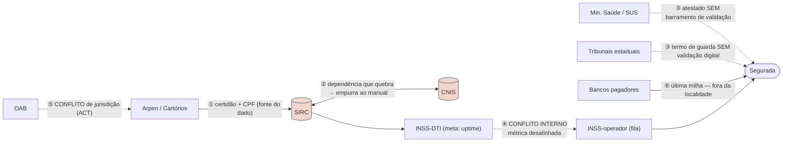

# Mapa de Atores — Jornada "Salário-Maternidade Urbano"

> **Metodologia:** Mapeamento de Atores em Diagnóstico de Serviço Público (Aula 02 — *Diagnóstico de Serviço Público*, slides 30–44).
> **Contexto / evidências:** `B_relatorio_assistente_v3.md` (fluxo de concessão do Salário-Maternidade Urbano, 2025–2026).
> **Construção:** elaborado via entrevista estruturada (grill) — ver transcrição em `C_grill_transcript.md`.

---

## Passo 0 — Propósito do mapa

> **Endereçar a *failure demand* do desvio para o canal manual no Salário-Maternidade Urbano** — o represamento que originou a força-tarefa MAES (61.616 processos com atraso > 30 dias, dentro de um universo de 190.294 pendentes em maio/2026) — partindo do princípio de que **o fato gerador é um dado que o Estado já possui** (certidão de nascimento gerada com o CPF da criança; base SIRC/CRC Nacional). Boa parte dessa demanda manual, portanto, **"não deveria existir"** (Seddon, *failure demand*).

Tipo de propósito (slide 34): **endereçar uma falha específica** (judicialização / represamento manual), e **não** uma reorientação estratégica ampla — para que o mapa direcione ação em vez de virar lista.

---

## Passo 1 — Inventário de atores

Partindo do cidadão e expandindo concentricamente (slide 35), com destrinchamento de sub-grupos. O **INSS é desdobrado em três chapéus** por exercer papéis com incentivos distintos.

### Centro — Usuários diretos
- **Segurada "sem certidão" estrutural** — adoção/guarda, afastamento pré-parto, aborto não criminoso (manual por natureza; documento sem *match* no SIRC).
- **Segurada "com certidão" que quebrou** — *deveria* ter concessão automática, mas caiu no manual por queda do SIRC ou divergência CNIS ↔ registro civil (*failure demand* "pura" — dado que o Estado já tinha).
- *Empregada CLT — **ator de borda*** (paga pelo empregador via eSocial/DCTFWeb/PER-DCOMP; roteada para fora das filas diretas do INSS).

### Anel 2 — Operadores / linha de frente
- Analistas do INSS na fila manual (SIBE / Prisma).
- **Força-tarefa MAES** (analistas mobilizados, 8–22/maio/2026).
- Atendimento telefônico 135.
- Postos descentralizados (servidores municipais e agentes sindicais treinados via ACT).

### Anel 3 — Gestores / Decisores (INSS — 3 chapéus)
- **INSS-normatizador** — editou a IN PRES/INSS nº 188/2025.
- **INSS-dono-da-automação** — DTI / CGAUT, donos do motor de regras (*Workflow*).
- **INSS-operador** — Diretoria de Benefícios; coordenação da MAES; Presidência.
- Ministério da Previdência Social.

### Anel 4 — Órgãos de Controle
- **TCU** (Acórdão 1606/2025 — ver ressalva em H5); CGU; MPF.

### Anel 5 — Fornecedores de TI
- **Dataprev** — fornecedor nuclear (backend CNIS / Meu INSS / processamento; operador histórico do SIRC).
- **SERPRO** — fornecedor periférico (identidade gov.br / barramento / sistemas da Receita).
- Provedores de infraestrutura e conexão das agências.

### Anel 6 — Intermediários
- **OAB / advocacia previdenciária** (canal INSS Digital).
- **Arpen-Brasil / cartórios de registro civil** (ACT de concessão no balcão).
- Sindicatos e prefeituras (ACTs de capilaridade).
- Contadores / despachantes (MEI).

### Anel 7 — Normatizadores / Judiciário
- **STF** (ADIs nº 2.110 e 2.111).
- Receita Federal (eSocial / DCTFWeb / PER-DCOMP Web).
- **Ministério da Saúde / SUS + Conselhos de Medicina (CRM)** — atestados pré-parto.
- **Tribunais estaduais** — termos de guarda judicial (adoção).
- **Justiça Federal** — judicialização (~90% das ações).
- **Defensoria Pública da União (DPU)** — proteção das seguradas hipossuficientes em causas judiciais contra o INSS.
- **Bancos pagadores** — execução do pagamento final (última milha; nem sempre na localidade mais próxima da requerente).

### Anel externo — Vozes Críticas (slide 36 — evitam *confirmation bias*)
- Controle social organizado (Transparência Brasil, Open Knowledge BR).
- Conselhos de usuários (Lei 13.460/2017 — Código de Defesa do Usuário).
- Ouvidorias / CGU.
- Jornalismo de dados (Agência Pública; portal *meutudo* — dados via LAI).

---

## Passo 2 — Classificação (Matriz de Mendelow: Poder × Interesse)

Lentes dos *padrões brasileiros* (slide 38): controle = alto poder/baixo interesse na rotina (mas "vira de noite pro dia" numa auditoria); intermediários = posição paradoxal, alto interesse que se beneficia da complexidade.

| | **Baixo Interesse** | **Alto Interesse** |
|---|---|---|
| **Alto Poder** | **Manter satisfeito** TCU, CGU, MPF **Dataprev** *(poder total sobre os sistemas; interesse ancorado em uptime/contrato — não na qualidade do serviço)* | **Gerenciar de perto** INSS-normatizador; INSS-dono-da-automação (DTI/CGAUT); Min. Previdência; **OAB**; **Arpen/cartórios**; Receita Federal |
| **Baixo Poder** | **Monitorar** SERPRO; bancos pagadores; Min. Saúde/CRM; Tribunais estaduais | **Manter informado** **Seguradas (centro)**; analistas da ponta + MAES (sem autonomia); **DPU**; vozes críticas |

> **Limitação do modelo (slide 37):** Mendelow é ponto de partida, não receita — não usar como "transmissão de mensagem ao stakeholder", e sim como base para escuta genuína.

**Notas de classificação (decisões do grill):**
- **Dataprev — Alto Poder / Baixo Interesse:** poder como fornecedor de TI; interesse desalinhado (SLA de disponibilidade).
- **Arpen/cartórios — Alto Poder / Alto Interesse:** responsáveis pelo registro do nascimento (fonte do dado) e podem perder receita em caso de mudança nos seus serviços.
- **Seguradas — Baixo Poder / Alto Interesse:** as ações nem sempre são judicializadas, então o poder agregado não se materializa — permanecem com baixo poder.

---

## Passo 3 — Incentivos e Resistências (atores de alto poder)

Para cada ator (slide 39): (1) o que **ganha hoje** com o serviço quebrado — *Manutenção*; (2) o que **perderia** com a transformação — *Resistência*; (3) o que **ganharia** com a mudança — *Alavanca*.

| Ator | (1) Ganha hoje com a falha | (2) Perde com a transformação | (3) Alavanca (ganharia com a mudança) |
|---|---|---|---|
| **INSS-dono-da-automação (DTI/CGAUT)** | Bate meta de *uptime* e de % geral de automação | Exposição se o redesenho do "sem certidão" falhar | Menos fila manual; meta de qualidade (FCR) em vez de só *uptime* |
| **INSS-operador (MAES/analistas)** | Força-tarefa gera protagonismo institucional e horas de trabalho | Esvaziamento da função se a automação avançar | Fim da sobrecarga crônica e do trabalho de "consertar imagem ilegível" |
| **OAB / advocacia previdenciária** | Mercado de instrução documental que **só existe porque o processo é complexo** | Reserva de atuação se o benefício virar trivial | Migrar de "digitador de documento" para litígio de mérito real → **aliada ambígua** |
| **Arpen / cartórios** | ACT lhes dá novo fluxo de receita/relevância como balcão | **Receita** se o INSS automatizar direto via SIRC sem o balcão | Protagonismo como **fonte do dado** (certidão + CPF na origem) |
| **Dataprev** | (executor **neutro**) — segue a especificação do INSS | Escopo contratual só se o redesenho simplificar a stack | Projetos de modernização → **o gargalo é de governança/SLA, não de incentivo perverso** |
| **TCU** | — (rotina: baixo interesse) | — | Reduzir pagamento indevido (Acórdão 1606/2025) → alavanca de cobrança |

**Reposicionamento do diagnóstico (decisões do grill):** a resistência **não** está no fornecedor de TI nem (só) na advocacia. Está **(a)** na governança/métrica — o SLA mede *uptime*, não *failure demand* — e **(b)** no modelo de balcão dos cartórios. **OAB = aliada potencial**; **Dataprev = executor neutro mal-direcionado**.

---

## Passo 4 — Mapeamento de Relações

Três artefatos complementares (slide 40).

### 4.1 — Diagrama de Rede (atores-ponte e densidade de conexões)

Ator focal no centro; densidade de conexões revela **atores-ponte** (Arpen/cartório e o eixo SIRC↔CNIS).

### 4.2 — Diagrama de Cebola / *Onion* (distância concêntrica do cidadão)

Núcleo (seguradas) → operadores → gestores/decisores → controle, normatizadores e atores externos.

### 4.3 — Mapa de Influência / Sociograma (onde a rede falha sob estresse)

Distingue fluxo de cooperação (—) de **conflito potencial** (- -). Destaca as **6 arestas críticas** que carregam a *failure demand*.

**Legenda das 6 arestas críticas:**
1. **Cartório/Arpen → certidão+CPF → SIRC → CNIS** — a charneira da automação ("o Estado já tem o dado").
2. **SIRC ⇄ CNIS** — dependência que, ao cair (164 falhas / ~20 dias fora entre jan/2023–abr/2024), empurra ao manual.
3. **Min. Saúde/SUS → atestado** e **Tribunais estaduais → termo de guarda** — documentos "sem certidão" sem barramento digital de validação.
4. **INSS-DTI (uptime) ⊥ INSS-operador (fila)** — conflito interno: a métrica desalinhada (a "métrica órfã").
5. **OAB ⟷ Arpen** — conflito de jurisdição (disputa do ACT dos cartórios).
6. **Bancos → última milha** — fricção de acesso (pagamento fora da localidade da requerente).

---

## Passo 5 — Atores-chave e Diagnóstico

### Atores-chave (8 — com poder de bloquear ou viabilizar a mudança)

1. **INSS-dono-da-automação (DTI/CGAUT)** — controla o motor de regras.
2. **INSS-operador (MAES/analistas)** — sofre e administra o represamento.
3. **INSS-normatizador** — editou a IN 188/2025.
4. **Arpen / cartórios** — fonte do dado + modelo de balcão.
5. **OAB** — aliada ambígua.
6. **Min. Saúde/SUS + Tribunais estaduais** — o "buraco" de validação digital do "sem certidão".
7. **TCU** — alavanca externa de cobrança.
8. **Defensoria Pública da União (DPU)** — protetora das seguradas hipossuficientes em causas judiciais; incentivo alinhado ao cidadão.

> As **seguradas** são o **sujeito** do mapa (não ator-chave): baixo poder, alto interesse.

### Hipóteses do diagnóstico

- **H1 — Métrica órfã:** o desvio "com certidão que quebrou" persiste porque a TI é cobrada por *uptime/SLA*, e **ninguém é dono da métrica de *failure demand*** — o desvio ao manual é invisível no painel de gestão.
- **H2 — Ponte interinstitucional sem dono:** a automação do "sem certidão" (atestado/guarda) não avança porque **falta barramento de validação digital** com Saúde e Tribunais, e **nenhum ator tem mandato nem incentivo** para construí-la. É um problema órfão.
- **H3 — Resistência no balcão, não na lei:** a simplificação radical (usar a certidão + CPF que o Estado **já tem**) ameaça o **modelo de receita de balcão dos cartórios**; a OAB resiste por reserva de mercado, **mas é convertível** em aliada se migrar para litígio de mérito.
- **H4 — Mutirão vira equilíbrio:** a MAES trata o **sintoma** (estoque) e não a causa raiz, criando um equilíbrio em que o **mutirão periódico substitui o redesenho** — e gera protagonismo institucional na resposta à crise.
- **H5 — TCU como gatilho:** o controle (alto poder / baixo interesse na rotina) **"vira de noite pro dia numa auditoria"** (slide 38) e é a alavanca que pode **forçar** o redesenho.
  > **Ressalva metodológica (auditoria):** o **Acórdão 1606/2025-TCU** trata da integridade do SIRC no **lado dos óbitos** (R$ 4,4 bi em pagamentos indevidos a falecidos), **não** do lado dos nascimentos. É utilizado aqui como **precedente/analogia** — prova de que a fragilidade de integridade do SIRC já foi reconhecida pelo TCU — para sustentar, por extensão, o risco no lado dos nascimentos (divergências CNIS ↔ registro civil que quebram a automação do salário-maternidade). A distinção óbito/nascimento é assinalada explicitamente para evitar *overclaim*.

---

### Síntese acionável

O gargalo do Salário-Maternidade Urbano **não é tecnológico de superfície** (upload ilegível), e sim **institucional**: uma *failure demand* sustentada por **(a) uma métrica órfã** (uptime ≠ qualidade), **(b) uma ponte interinstitucional sem dono** (Saúde/Tribunais) e **(c) modelos de intermediação que lucram com a complexidade** (balcão cartorário). As alavancas de mudança são o **TCU** (pressão externa de integridade), a **OAB convertida** em aliada e o **redesenho da meta interna do INSS** — usando o dado que o Estado **já possui** na origem do registro.
